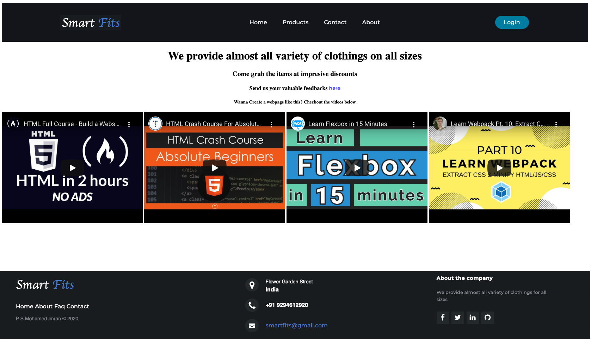
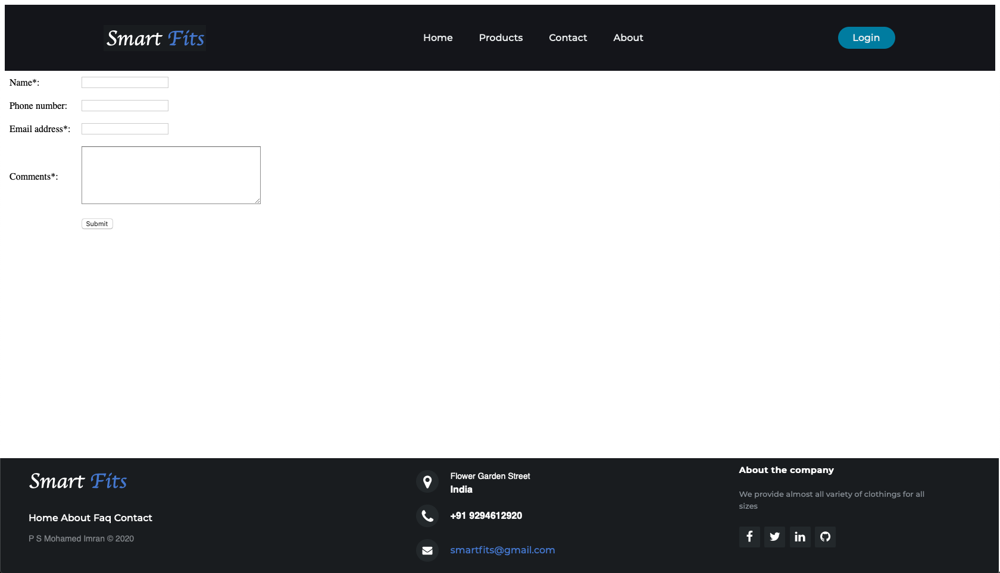

# Simple-Clothing-Store-Template-with-HTML-CSS-and-JS
Online Clothing store template named `SmartFits` built using HTML, CSS and vanilla Javascript

## Technologies Used
```bash
HTML
CSS
Javascript
```
## Code
Check out the code section for all the code files.

## Run Locally

- git clone https://github.com/Imran109/Clothing-Store-with-HTML-CSS-and-JS.git
- Open index.html file with any Browser and you are good to go

Let me know if you have any questions. [Email Mohamed Imran P S](mailto:mohamedimranps@gmail.com)

## Home Screen


## Product Screen - Shirts


## Product Screen - Pants


## About Screen


## Contact Screen


## Contributing
Pull requests are welcome. For major changes, please open an issue first to discuss what you would like to change.
Please make sure to update tests as appropriate.

## License
[Mohamed Imran P S](https://linkedin.com/in/mohamedimranps)
